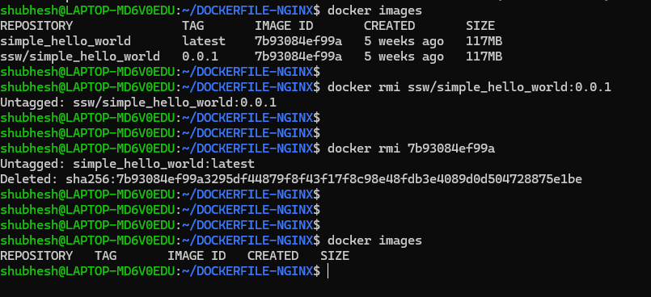

## List all containers running

```shell
docker ps
```

## List all containers including stopped containers

```shell
docker ps -a
```

## To run 

```shell
docker run nginx
```

## To run in detached mode

```shell
docker run -d nginx
```

## To run in detached mode and expose a port and name the  container

```shell
docker run --name web_server -d -p 8080: 80 nginx
```

## To stop container

```shell
docker stop < container name >
```

## To remove container

```shell
docker rm < container ID >
```

## To filter containers


```shell
docker docker ps | grep web_server
```

(or the preferred way) 

```shell
docker docker ps --filter name=web_server
```

## Remove multiple containers 

```shell
docker docker rm  $(docker ps -aq)
```

## Remove image

```shell
docker image rm < image name >
```

## See the logs

```shell
docker logs < container name >
```


## Follow the logs of the live container

```shell
docker logs -f < container name >
```


## To go inside of the conatiner

```shell
docker exec -it web_server /bin/bash
```

## Create simple docker file and run it: example

```shell
vim Dockerfile
```
add the below:

```
FROM ubuntu:latest
CMD ["echo", "Hello from my first Docker image!"]
```
save and exit

Build it:

```shell
docker build .
```

## Help command

```shell
docker --help

docker run --help
```

### To stop all the containers
```shell
docker stop $(docker ps -q)
```


### To remove all the containers
```shell
docker rm $(docker ps -aq)
```

### To remove all the images
```shell
docker rmi $(docker ps -q)
```



If you get the below error:
```shell
Error response from daemon: conflict: unable to delete 7b93084ef99a (must be forced) - image is referenced in multiple repositories
```

If there are some repository mentioned in the image, then first remove by untagging and then remove the image(like the below example)
```shell
docker rmi ssw/simple_hello_world:0.0.1
```

then remove the image
```shell
 docker rmi 7b93084ef99a
``` 
 
